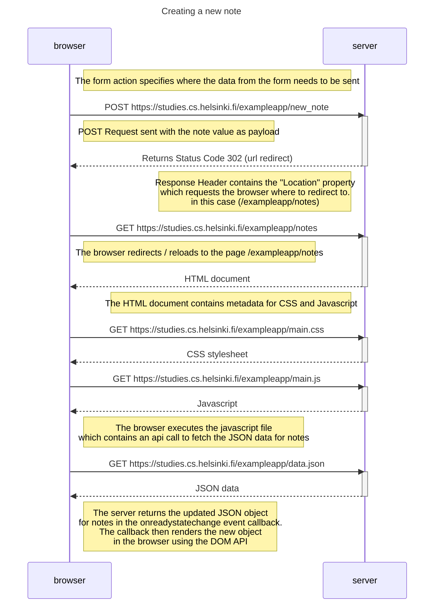

```mermaid

---
title: Creating a new note
---
sequenceDiagram
    participant browser
    participant server

    Note right of browser: The form action specifies where the data from the form needs to be sent

    browser->>server: POST https://studies.cs.helsinki.fi/exampleapp/new_note
    activate server
    
    Note right of browser: POST Request sent with the note value as payload

    server-->>browser: Returns Status Code 302 (url redirect)
    deactivate server
    
    Note left of server: Response Header contains the "Location" property<br/>which requests the browser where to redirect to.<br/> in this case (/exampleapp/notes)

    browser->>server: GET https://studies.cs.helsinki.fi/exampleapp/notes
    activate server
    
    Note right of browser: The browser redirects / reloads to the page /exampleapp/notes
    
    server-->>browser: HTML document
    deactivate server
    
    Note left of server: The HTML document contains metadata for CSS and Javascript

    browser->>server: GET https://studies.cs.helsinki.fi/exampleapp/main.css
    activate server
    server-->>browser: CSS stylesheet
    deactivate server

    browser->>server: GET https://studies.cs.helsinki.fi/exampleapp/main.js
    activate server
    server-->>browser: Javascript
    deactivate server
    
    Note right of browser: The browser executes the javascript file<br/> which contains an api call to fetch the JSON data for notes

    browser->>server: GET https://studies.cs.helsinki.fi/exampleapp/data.json
    activate server
    server-->>browser: JSON data
    deactivate server
    
    Note right of browser: The server returns the updated JSON object<br/> for notes in the onreadystatechange event callback.<br/> The callback then renders the new object<br/> in the browser using the DOM API
```