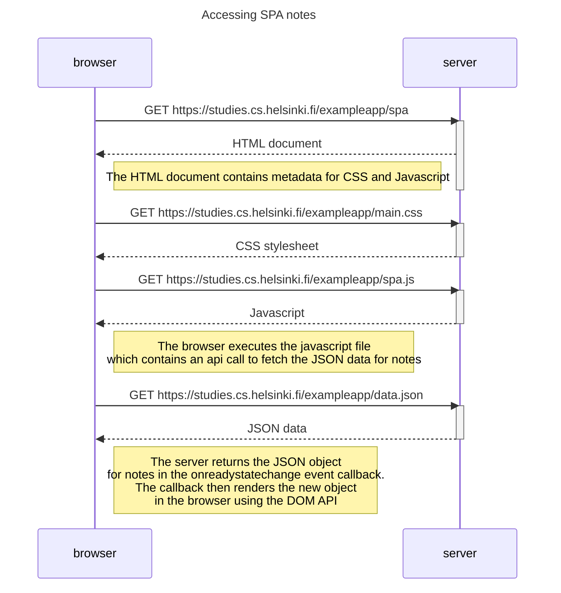

```mermaid

---
title: Accessing SPA notes
---
sequenceDiagram
    participant browser
    participant server

    browser->>server: GET https://studies.cs.helsinki.fi/exampleapp/spa
    activate server
    server-->>browser: HTML document
    Note left of server: The HTML document contains metadata for CSS and Javascript
    deactivate server

    browser->>server: GET https://studies.cs.helsinki.fi/exampleapp/main.css
    activate server
    server-->>browser: CSS stylesheet
    deactivate server

    browser->>server: GET https://studies.cs.helsinki.fi/exampleapp/spa.js
    activate server
    server-->>browser: Javascript
    deactivate server
    Note right of browser: The browser executes the javascript file<br/> which contains an api call to fetch the JSON data for notes

    browser->>server: GET https://studies.cs.helsinki.fi/exampleapp/data.json
    activate server
    server-->>browser: JSON data
    deactivate server
    Note right of browser: The server returns the JSON object<br/> for notes in the onreadystatechange event callback.<br/> The callback then renders the new object<br/> in the browser using the DOM API
```