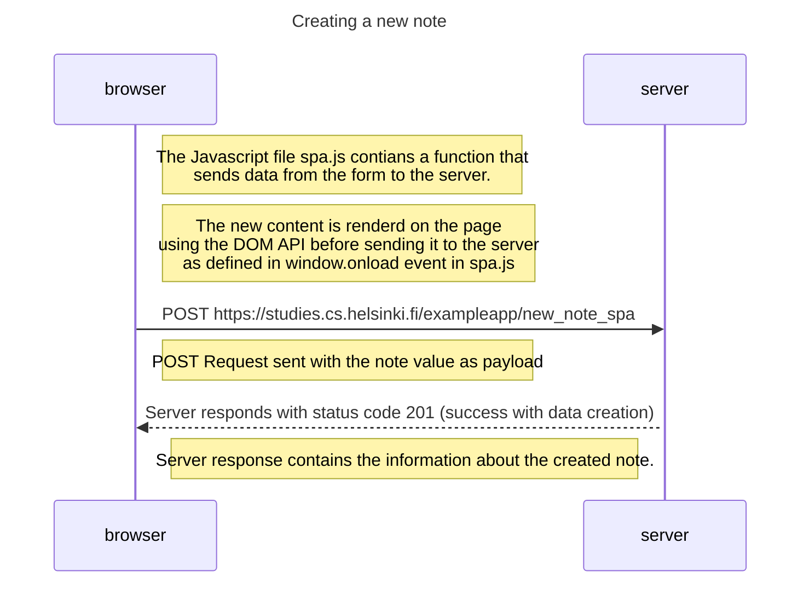

```mermaid

---
title: Creating a new note
---
sequenceDiagram
    participant browser
    participant server

    Note right of browser: The Javascript file spa.js contians a function that<br/> sends data from the form to the server.

    Note right of browser: The new content is renderd on the page <br/>using the DOM API before sending it to the server<br/> as defined in window.onload event in spa.js
    
    browser->>server: POST https://studies.cs.helsinki.fi/exampleapp/new_note_spa
    
    Note right of browser: POST Request sent with the note value as payload
    activate server

    server-->>browser: Server responds with status code 201 (success with data creation)

    Note left of server: Server response contains the information about the created note. 


```